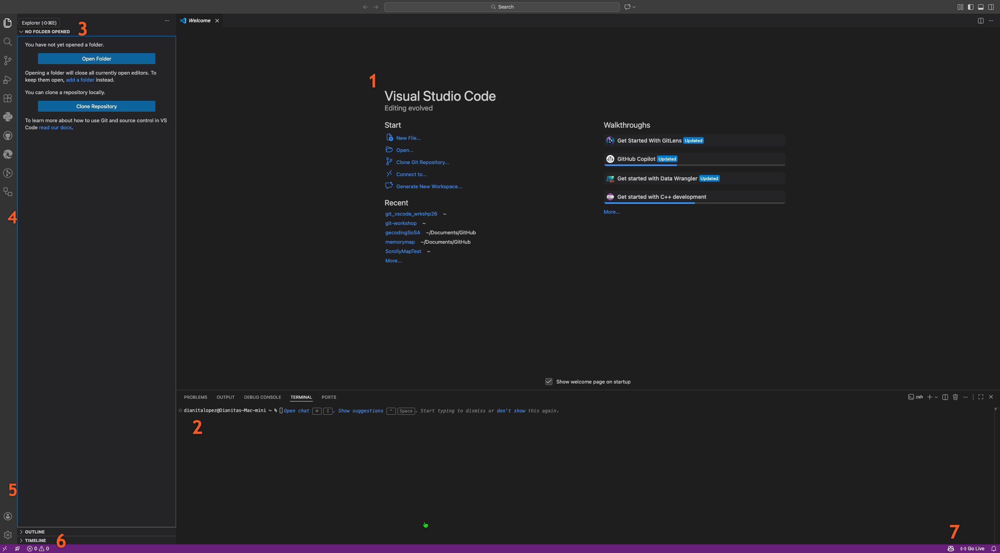

## Overview of VS Code Interface 

 

1. **Editor** - The main area where you write and edit your code/text files
2. **Terminal** - Built-in command line (same as your computer's terminal!)
3. **Explorer** - Your project files and folders
4. **Activity Bar** - Icon strip on the far left - click to change views
5. **Accounts** - Sign in to GitHub (we'll use this later!)
6. **Status Bar** - Bottom bar showing: branch name (left), file info (right)

---
## The Main Component, let's break it down

### 1. **Activity Bar** (left side bar)

This is your navigation hub. Click these icons to change what appears in the side bar:

- **Explorer**
- **Search**
- **Source Control**
- **Extensions** 

---

### 3. **Editor Area** the big space in the middle

This is where you write and edit your files. 

**things to know:**
- each file opesn in a **tab** at the top
- you can have multiple files open at once
- you can split the editor to see two files side-by-side. (view » editor layout or top right corner icons)

---
### 4. **Terminal Panel**, the bottom section

Rem

